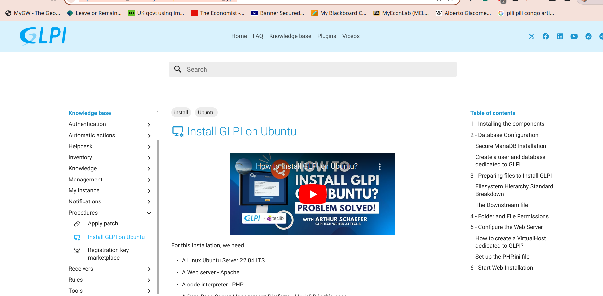
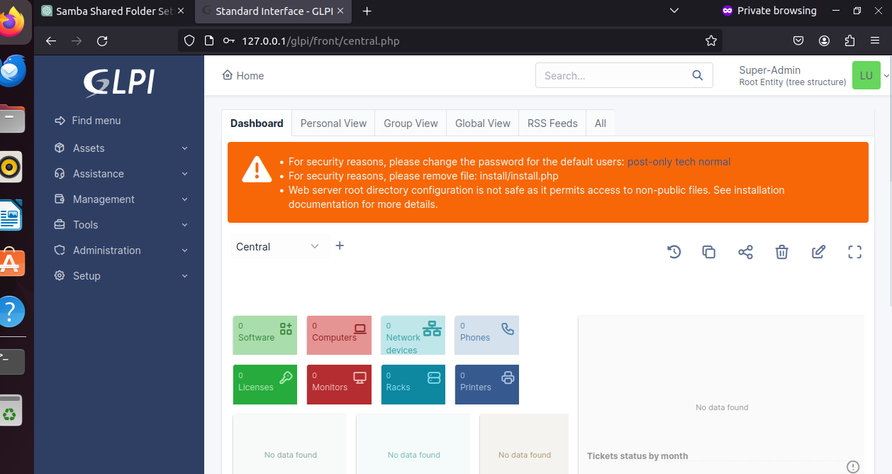

# CLPI

## Updating

First we go online and look for to install CLPI on our system. Thankfully for us GLPI has a whole documentation on installing GLPI on Unbuntu system:



If you would like to follow the guide in its totality you can do so [here](https://faq.teclib.com/03_knowledgebase/procedures/install_glpi/)

Our first step is to make sue everything is up to date:

```bash
$ apt update && apt upgrade
```

## Apache2 and MariaDB Installation

Now we want to install apache and mariaDB which we will need to run CLPI for that we will run:

```bash
$ apt install -y apache2 php php-{apcu,cli,common,curl,gd,imap,ldap,mysql,xmlrpc,xml,mbstring,bcmath,intl,zip,redis,bz2} libapache2-mod-php php-soap php-cas
```

```bash
$ apt install -y mariadb-server
```

## Setting up Maria DB 

First we want to run mariaDB secure installation so we can set everything up for our user later:

```bash
$ mysql_secure_installation
```
Now we want to create a user and database dedicated for GLPI:

```bash
$ mysql -uroot -pmysql
CREATE DATABASE glpi;
CREATE USER 'glpi'@'localhost' IDENTIFIED BY 'yourstrongpassword';
GRANT ALL PRIVILEGES ON glpi.* TO 'glpi'@'localhost';
GRANT SELECT ON `mysql`.`time_zone_name` TO 'glpi'@'localhost';
FLUSH PRIVILEGES;
```

## GLPI installation

First we need to prepare to install GLPI:

```bash
 cd /var/www/html
wget https://github.com/glpi-project/glpi/releases/download/10.0.12/glpi-10.0.12.tgz
tar -xvzf glpi-10.0.12.tgz
```
So first we go into our HTML folder, install the GLPI file then unzip it.

Now we want to create a downstream file:

```bash
$ vim /var/www/html/glpi/inc/downstream.php
```

Now we want to insert the following in the folder:

```php
<?php
define('GLPI_CONFIG_DIR', '/etc/glpi/');
if (file_exists(GLPI_CONFIG_DIR . '/local_define.php')) {
require_once GLPI_CONFIG_DIR . '/local_define.php';
}
```
Now we have to move a few files:

```bash
mv /var/www/html/glpi/config /etc/glpi
mv /var/www/html/glpi/files /var/lib/glpi
mv /var/lib/glpi/_log /var/log/glpi
```
The next step is creating another files:

```bash
$ vim /etc/glpi/local_define.php
```
In that file we want to past the following:

```php
<?php
define('GLPI_VAR_DIR', '/var/lib/glpi');
define('GLPI_DOC_DIR', GLPI_VAR_DIR);
define('GLPI_CRON_DIR', GLPI_VAR_DIR . '/_cron');
define('GLPI_DUMP_DIR', GLPI_VAR_DIR . '/_dumps');
define('GLPI_GRAPH_DIR', GLPI_VAR_DIR . '/_graphs');
define('GLPI_LOCK_DIR', GLPI_VAR_DIR . '/_lock');
define('GLPI_PICTURE_DIR', GLPI_VAR_DIR . '/_pictures');
define('GLPI_PLUGIN_DOC_DIR', GLPI_VAR_DIR . '/_plugins');
define('GLPI_RSS_DIR', GLPI_VAR_DIR . '/_rss');
define('GLPI_SESSION_DIR', GLPI_VAR_DIR . '/_sessions');
define('GLPI_TMP_DIR', GLPI_VAR_DIR . '/_tmp');
define('GLPI_UPLOAD_DIR', GLPI_VAR_DIR . '/_uploads');
define('GLPI_CACHE_DIR', GLPI_VAR_DIR . '/_cache');
define('GLPI_LOG_DIR', '/var/log/glpi');
```
After we have to change some permissions by running:

```bash
chown root:root /var/www/html/glpi/ -R
chown www-data:www-data /etc/glpi -R
chown www-data:www-data /var/lib/glpi -R
chown www-data:www-data /var/log/glpi -R
chown www-data:www-data /var/www/html/glpi/marketplace -Rf
find /var/www/html/glpi/ -type f -exec chmod 0644 {} \;
find /var/www/html/glpi/ -type d -exec chmod 0755 {} \;
find /etc/glpi -type f -exec chmod 0644 {} \;
find /etc/glpi -type d -exec chmod 0755 {} \;
find /var/lib/glpi -type f -exec chmod 0644 {} \;
find /var/lib/glpi -type d -exec chmod 0755 {} \;
find /var/log/glpi -type f -exec chmod 0644 {} \;
find /var/log/glpi -type d -exec chmod 0755 {} \;
```
We need to create a configuration file for our server:

```bash
$ nano /etc/apache2/sites-available/glpi.conf
```
In that fle we need to put:
```bash
# Start of the VirtualHost configuration for port 80

<VirtualHost *:80>
    ServerName yourglpi.yourdomain.com
    # Specify the server's hostname
    DocumentRoot /var/www/html/glpi/public
    # The directory where the website's files are located
    # Start of a Directory directive for the website's directory
    <Directory /var/www/html/glpi/public>
        Require all granted
        # Allow all access to this directory
        RewriteEngine On
        # Enable the Apache rewrite engine
        # Ensure authorization headers are passed to PHP.
        # Some Apache configurations may filter them and break usage of API, CalDAV, ...
        RewriteCond %{HTTP:Authorization} ^(.+)$
        RewriteRule .* - [E=HTTP_AUTHORIZATION:%{HTTP:Authorization}]
        # Redirect all requests to GLPI router, unless the file exists.
        RewriteCond %{REQUEST_FILENAME} !-f
        RewriteRule ^(.*)$ index.php [QSA,L]
    </Directory>
    # End of the Directory directive for /var/www/glpi/public
</VirtualHost>

# End of the VirtualHost configuration for port 80
```
just remember to change to domain space tp reflect the domain name you chose.

Next we have to set up a php.ini file:

```bash
$ vim /etc/php/8.1/apache2/php.ini
```
change the following parameters:
- upload_max_filesize = 20M Maximum size for uploaded files is set to 20 megabytes.
- post_max_size = 20M Maximum size for POST data (e.g., form submissions) is also set to 20 megabytes.
- max_execution_time = 60 Maximum execution time for a PHP script is set to 60 seconds.
- max_input_vars = 5000 Maximum number of input variables (e.g., form fields) a script can accept is 5000.
- memory_limit = 256M The maximum amount of memory a single PHP script can use is 256 megabytes.
- session.cookie_httponly = On Sets the "HttpOnly" attribute for session cookies
date.timezone = America/Sao_Paulo Sets the default timezone for PHP to yours.

Now you can move on to working on things from your browser by accessing localhost:"IP address or domain name"/glpi
enter the name of your database you set up earlier, the default username and password for GLPI(both are glpi).
click next then click update DB, select glpi (the name we gave the DB earlier). click next and then you should be logged in!


Now follow the settings and chnge the username and password to access GLPI, and you are done with this step! Now you can move on to the [next](./CLPI.md).