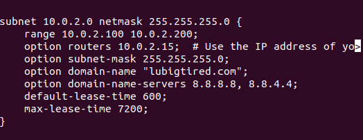

# DHCP
## Installation
First let's make sure everything is up to date:

```bash
$ sudo apt update
```

Then we want to install DHCP:

```bash
$ sudo apt install isc-dhcp-server
```
Once we have it installed we want to configure it to meet the reqrements for our system. You may want to check what your VM's IP address is by running:

```bash
$ ip address
```
After go to your config file which should be in /etc/dhcp/dhcpd.conf then make sure to put the correct IP address, subnet mask and the domain name of your choice.
For example My file looked something like this:



Now it is time to restart our DHCP server:

```bash
$ sudo systemctl restart isc-dhcp-server
```
If at any point you want to heck the status of your DHCP server you can do so by running:

```bash
$ sudo systemctl status isc-dhcp-server
```
And congrats! You should be done with your DHCP server set up! Now you can move on to the [DNS](./DNS.md) set up.