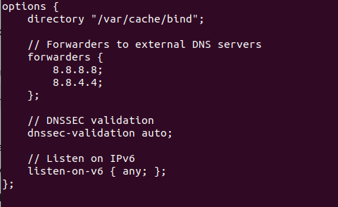
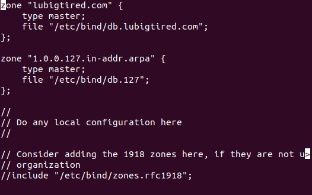
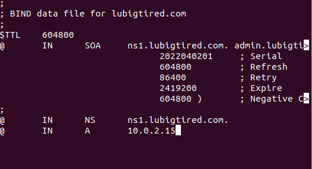

# DNS
The next step is to take care of our DNS server for this we use bind9. To use it we will first have to install it:

```bash
$ sudo apt install bind9
```

The tricky aspect of the DNS server is that you have two configuration files to take care of. But do not fret, they are not hard to set up.

The first file is /etc/bind/named.conf.options 
In case you need a reference of how my set up looks like:



Now comes the file that may be a little more complicated, but again no worries I am here to help you! The file we want to edit is /etc/bind/named.conf.local
For reference here is mine:



The first thing we see here are the zones. The first one set up is our custom domain name, if you do not have it you my need to make a db."domain name" file for it. Here is what mine looks like:



Let's go Back to our local configuration file:


we see that the second zone is our IP address reversed this is the general rule of thumb for the DNS configuration. 

After editing what is necessary you have to restart bind9, for that run:

```bash
$ sudo systemctl restart bind9
```
If at any point you want to check the status of your DNS server:

```bash
$ sudo systemctl status bind9
```
And you are done with the DNS set up! Congrats!!! Now lets move on to the next step, [CLPI](./CLPI.md)


