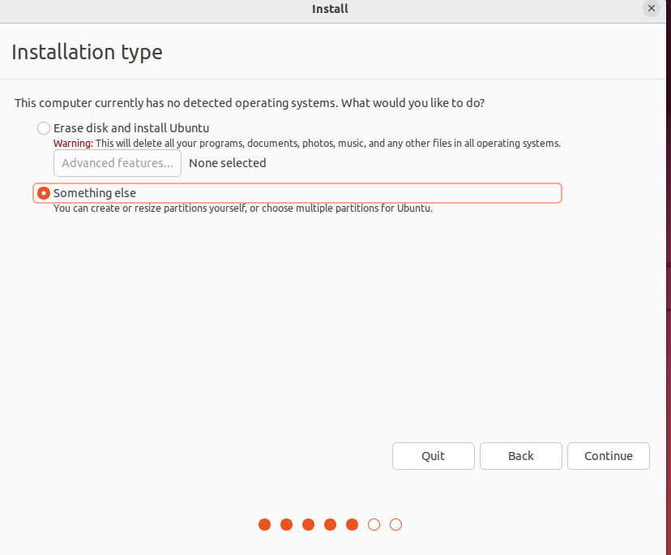
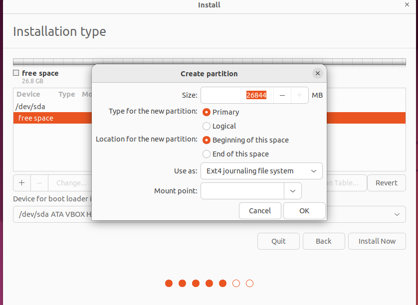
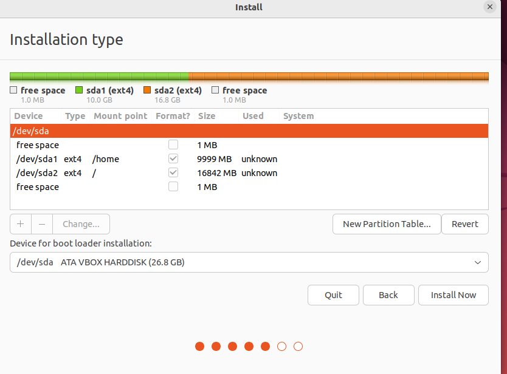

# Partitioned Home Directory
So now that we are on the Ubuntu set up we have the choice how to organize our OS. Select Something else to start the process for the partition.

Now we click continue. The we click on free space, after that click on the + sign. Then give it the appropriate space and create your home partition.

We repeat the same step for our root file then we will be showing a screen showing how everything will be partitioned, we will only be able to click next if we use all the free space available so make sure you do so. After check that everything is set up according to what ou need and click next.

And we are done with the partitioning. After you can continue the [Ubuntu](./UBUNTU.md) set up!