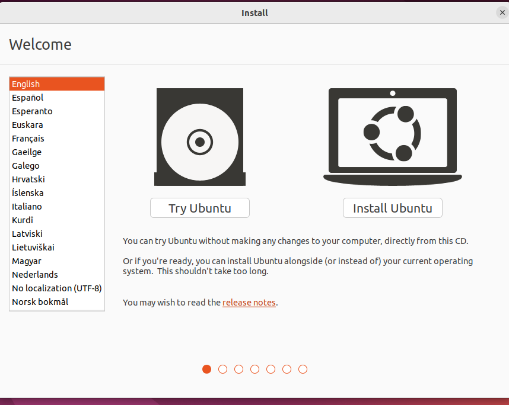
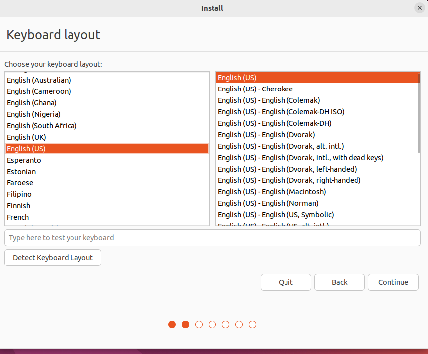

# Setting Up Ubuntu
We first need to go online and download the Ubuntu desktop.

Once we have the ISO we can now go back to virtual box to use the Ubuntu ISO on our virtual machine (you can go back to that step [here](./VM.md)).

Once we are done with the virtual machine set up we will be prompted the ubuntu installation inside our virtual environment. 

Once the installation menu pops up we select install Ubuntu.

 

After we select our language.

Next, we will be prompted on how we would like to organize our desktop. Here we want to select something else for the client end if you want to follow more on that click [here](./HOME.md).

And then we should be ready to use our envionment!