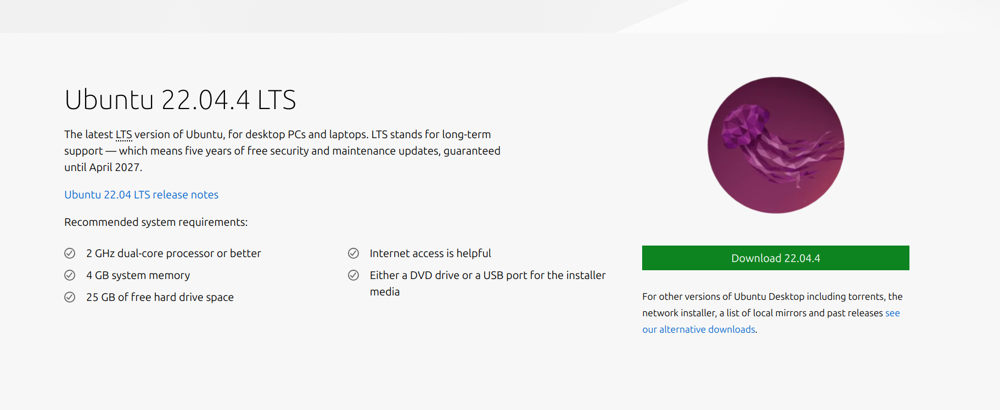

# Setting Up Ubuntu
We first need to go online and download the Ubuntu desktop.

Once we have the ISO we can now go back to virtual box to use the Ubuntu ISO on our virtual machine (you can go back to that step [here](./VM.md)).

Once we are done with the virtual machine set up we will be prompted the ubuntu installation inside our virtual environment.
