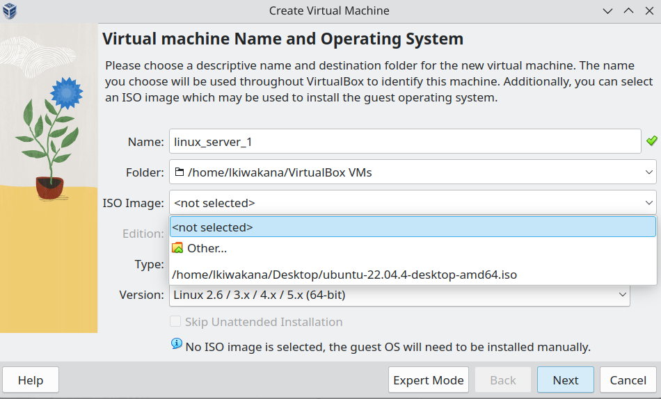
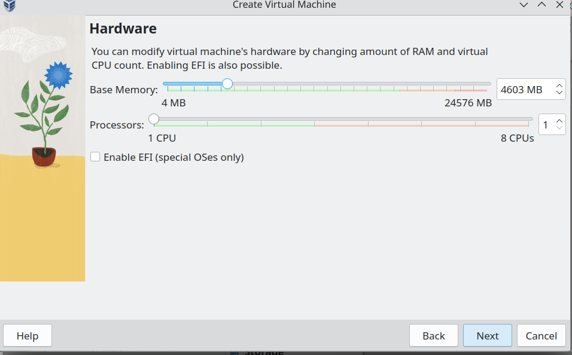

# Virtual Machine Set Up
## What Do We Need?
- Two virtual machines
- both have storage etc set according to the ubuntu requirements.
## How Do You Actually Set Them Up?
First, we need to download virtual box from its website and select the one that corresponds to our OS. In my case that will be Fedora.

So first we select Linux distribution systems.

 

Then we select fedora, in my case 37.

Then we wait for it to download. Once it is don we open virtual Box. For the next step we will need to have an ISO image for Ubuntu. To see how to do that you can do so [here](./UBUNTU.md).

Once the Ubuntu ISO file is on our local machine we can enter the path to it in ISO image. We can also give our file a name. We also click on the box Skip Unattended Installation

 

We then will be prompted to choose our storage etc, we should do so according to what Ubuntu puts as their minimum requirements to run their desktop.

 

Then once your VM is done, it will open automatically and prompt you to the Ubuntu set up, which you can continue reading about [here](./UBUNTU.md).
