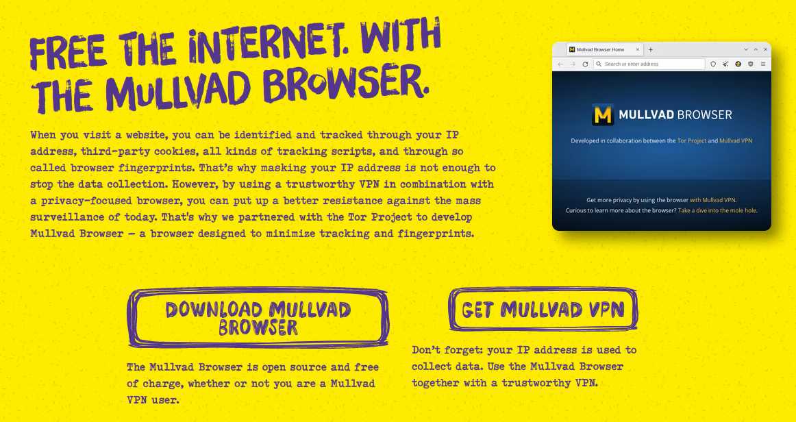

# Work Station

On our workstation we need to have LibreOffice, Gimp and the Mullvad browser installed. We also need to create a partition for Home which you can follow [this](./HOME.md).

## Automatic Addressing

Ubuntu comes with automatic addressing by default, just make sure in your Virtual Box network settings that it is enabled when you run your machine.

## LibreOffice and GIMP

To install LibreOffice and Gimp run:

```bash
$ sudo apt install libreoffice gimp
```

## Mullvad Browser

We go on the official Mullvad website and download the mullvad browser.



click download then once it is done downloading set it up an you are done!


